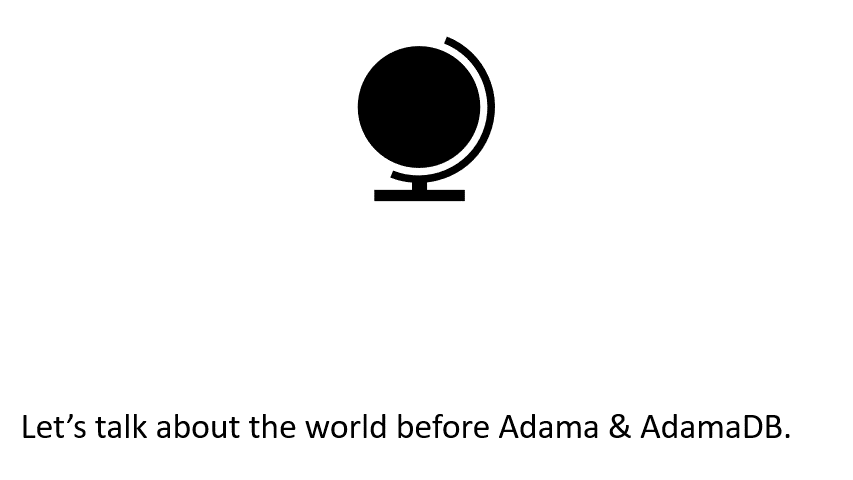

# AdamaDB & Adama Programming Language
The mission of Adama is to simplify building online board games. With a bit of spit, polish, and some [Yak shaving](https://en.wiktionary.org/wiki/yak_shaving), it ended up as a custom database and programming language. So, let's talk about what this thing is, and this animated GIF is a good summary:



Neat, right? Adama, the language, is a way of laying out state and then defining how to manipulate that state within a closed container. Manipulation of state is done by people via messages, and the document is computed reactively similar to Excel.

Now, the entire purpose is to play an online board game, but this extends well beyond board games. However, manifesting those values will take time to communicate. For now, the key is that players connect to a shared document, and the document enforces both rules and privacy via the Adama langauge.

For more information on why, please refer to [the origin story](http://www.adama-lang.org/docs/why-the-origin-story) over at http://www.adama-lang.org/

# OK, How do I play with this thing?

Well... you need to install java 11 and maven. I'm currently using Ubuntu within Windows Linux Subsystem, but you can check out the repo and then build the jar via

```sh
./build.py jar
```

Then you can run the demo
```sh
./demo.py
```

[You see more in the tutorial series within the documentation.](http://www.adama-lang.org/docs/how-devkit-install)

# License

Board games are the foothold killer use-case for Adama, but the ultimate goal of Adama is to redefine how applications get built with user-centric privacy as a first-class consideration. This ambitious goal of changing the entire landscape requires an open agenda, so the language is open source under the [Apache 2 license](LICENSE).

